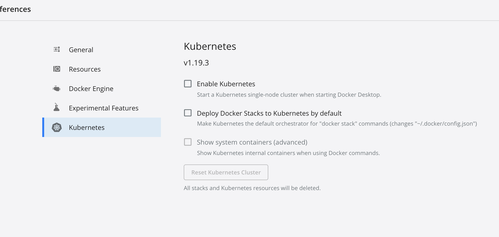
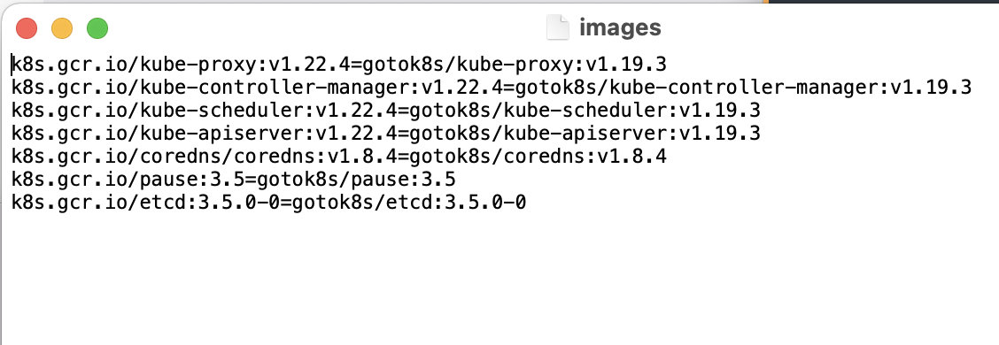

# Install Kubernetes on Mac

## Install Docker

1. Go to the [Docker Website](https://docs.docker.com/desktop/mac/release-notes/edge-releases/) and download the edge version

## Install Kubernetes
1. Open docker-settings-kubernetes, check the version number

2. open the terminal, type:
```
git clone https://github.com/gotok8s/k8s-docker-desktop-for-mac.git
```
3. open this folder, change the kube related version inside the images to the same as the docker shows

4. Type in the terminal:
```
	./images.sh
```
5. go the the setting of docker and click "Enable Kubernetes", press apply and restart
6. Check whether it is successful:
```
	$ kubectl cluster-info
	$ kubectl get nodes
	$ kubectl describe node
```
## Deploy Kubernetes Dashboard
1. type in the terminal
```
$ kubectl apply -f https://raw.githubusercontent.com/kubernetes/dashboard/master/aio/deploy/recommended.yaml
$ kubectl proxy
```
2. enter into the website:
[Dashboard](http://localhost:8001/api/v1/namespaces/kubernetes-dashboard/services/https:kubernetes-dashboard:/proxy/)

